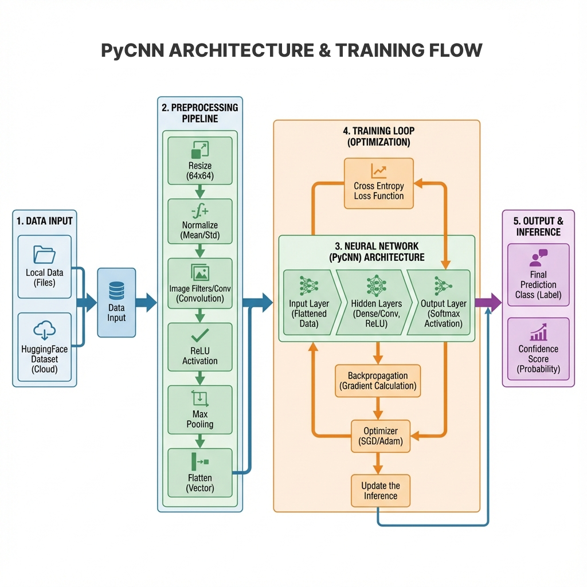
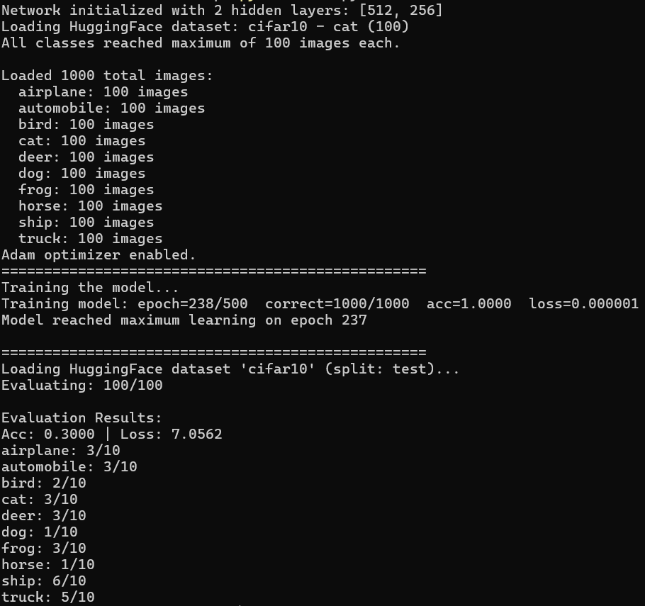

<p align="center">
  <br><strong >A Python library to easily build, train, and test your CNN AI models.</strong>
  
</p>

<p align="center">
  <a href="https://github.com/77axel/PyCNN/actions/workflows/ci.yml"></a>
  <a href="https://github.com/77axel/PyCNN/actions/workflows/build-wheels.yml"></a>
  
  
  
  
  
</p>

**Live Demo:** [PyCNN CIFAR-10 Model](https://huggingface.co/spaces/777axel/pycnn_cifar10)

This is a Convolutional Neural Network (CNN) library project implemented entirely from scratch using only low-level libraries like NumPy, PIL, SciPy and Cython no deep learning frameworks (e.g., TensorFlow or PyTorch) are used. It can train a CNN model on your local dataset folder or an external Hugging Face dataset, save or load models, support CUDA and the Adam optimizer for better performance, and switch the training backend between CPU and GPU

<p align="center">
  
</p>

---

## 🚀 Key Features

* Multi-class classification
* Model save/load functionality
* RGB image preprocessing with customizable filters
* Real-time training visualization (accuracy & loss per epoch)
* **CUDA acceleration** for faster training and inference
* **Adam optimizer** for improved convergence
* **Dynamic user-defined layers** for customizable architectures
* **Automatic backend conversion** between CPU and GPU
* **Hugging Face datasets** support
* **Dataset augmentation** support
* **PyTorch export** to convert PyCNN models to PyTorch format

---

## 📋 Requirements

### Python Dependencies

- Python 3.8+
- NumPy
- Pillow (PIL)
- SciPy
- Matplotlib (for visualization)

**Optional:**
- CuPy (for CUDA support)
- datasets (for Hugging Face integration)
- PyTorch (for model export)

> [!NOTE]
> **No Compiler Required!** PyCNN now automatically downloads pre-compiled binaries for Windows, Linux, and macOS. You no longer need to install GCC or build tools for regular usage.

### For Contributors (Development Setup)

If you want to build from source or contribute to the project, you'll need a C++ compiler:

<details>
<summary>Click to expand compiler installation instructions</summary>

**Linux (Ubuntu/Debian):**
```bash
sudo apt-get update
sudo apt-get install build-essential
```

**Linux (Fedora/RHEL):**
```bash
sudo dnf install gcc gcc-c++ make
```

**macOS:**
```bash
xcode-select --install
```

**Windows:**
- Install [MinGW-w64](https://www.mingw-w64.org/) or [Microsoft Visual C++ Build Tools](https://visualstudio.microsoft.com/visual-cpp-build-tools/)

</details>

---

## 📌 Installation

```bash
pip install git+https://github.com/77AXEL/PyCNN.git
```

Standard installation will automatically fetch pre-built binaries for your platform. If no matching binaries are found, it will attempt to build from source (requires a compiler).

**Optional - CUDA Support:**
```bash
pip install cupy-cuda118
```
*See the [CUDA Documentation](https://nvidia.github.io/cuda-python/latest/) for setup details.*

---

## 🖼 Dataset Structure

For local datasets, organize your data as follows:

```
data/
├── train/
│   └── class1/
│       ├── image1.png
│       ├── image2.png
│   └── class2/
│       ├── image1.png
│       ├── image2.png
│   └── class.../
└── test/
    └── class1/
        ├── image1.png
        ├── image2.png
    └── class2/
        ├── image1.png
        ├── image2.png
    └── class.../
```

Each subfolder represents a class

---

## 🖥️ Usage

### Training a Model

```python
from pycnn.pycnn import PyCNN, Evaluate

# Initialize model
pycnn = PyCNN()
pycnn.cuda(True)  # Enable CUDA (requires CuPy)

# Configure network architecture
pycnn.init(
    batch_size=32,
    layers=[256, 128, 64],
    learning_rate=0.0001,
    epochs=100
)

# Use Adam optimizer
pycnn.adam()

# Load dataset from Hugging Face
pycnn.dataset.hf(
    "cifar10",
    max_image=1000,
    split="train",
    cached=True
)

# Or load local dataset
# pycnn.dataset.local("path/to/dataset", max_image=1000)

# Train with visualization and early stopping
pycnn.train_model(visualize=True, early_stop=10)

# Evaluate model
eval = Evaluate(pycnn)
eval.hf(dataset_name="cifar10", max_image=10)
```

### Saving and Loading Models

```python
# Save model
pycnn.save_model("model.bin")

# Load model
pycnn.load_model("model.bin")

# Export to PyTorch format
pycnn.torch("model.pth")
```

### Making Predictions

```python
# Predict on a new image
class_name, confidence = pycnn.predict("test_image.png")
print(f"Prediction: {class_name} ({confidence*100:.2f}%)")
```

---

## 🔄 PyTorch Integration

### Export PyCNN Model to PyTorch

```python
from pycnn.pycnn import PyCNN

pycnn = PyCNN()
pycnn.init(epochs=50, layers=[64, 32])
pycnn.dataset.hf("cifar10", max_image=50)
pycnn.adam()
pycnn.train_model()

# Export to PyTorch
pycnn.torch("model.pth")
```

### Use Exported Model in PyTorch

```python
from pycnn.pycnn import PyCNNTorchModel
from PIL import Image
import numpy as np
import torch

# Load checkpoint
checkpoint = torch.load('model.pth', map_location='cpu')
model = PyCNNTorchModel(
    checkpoint['layers'],
    checkpoint['num_classes'],
    checkpoint['filters'],
    checkpoint['image_size']
)

model.load_state_dict(checkpoint['model_state_dict'])
model.eval()

# Predict
def predict(image_path):
    img = Image.open(image_path).convert("RGB")
    img = img.resize((checkpoint['image_size'], checkpoint['image_size']))
    img_array = np.array(img).astype(np.float32) / 255.0
    img_tensor = torch.from_numpy(img_array).permute(2, 0, 1).unsqueeze(0)
    
    with torch.no_grad():
        output = model(img_tensor)
        confidence, predicted_idx = torch.max(output, 1)
        predicted_class = checkpoint['classes'][predicted_idx.item()]
    
    print(f"Prediction: {predicted_class} ({confidence.item()*100:.2f}%)")

predict("example.png")
```

---

## 🧪 How It Works

1. **Image Preprocessing**: Images are resized, normalized, and processed through custom convolution filters with ReLU activation and max-pooling
2. **Feature Extraction**: Flattened feature maps are fed into fully connected layers
3. **Classification**: Dense layers compute activations followed by softmax for multi-class classification
4. **Backpropagation**: Gradients are computed and weights updated using Adam or SGD optimizer
5. **GPU Acceleration**: CUDA support enables parallel processing for faster training

---

## 📊 Example Output

```python
from pycnn.pycnn import PyCNN, Evaluate

pycnn = PyCNN()
pycnn.cuda(False)
pycnn.init(layers=[512, 256], epochs=500)
pycnn.dataset.hf("cifar10", max_image=100, cached=True)
pycnn.adam()
pycnn.train_model(early_stop=15)

eval = Evaluate(pycnn)
eval.hf(dataset_name="cifar10", max_image=10)
```



---

## 💬 Contributing

We welcome contributions, issues, and suggestions! Check the [Discussions tab](https://github.com/77AXEL/PyCNN/discussions) or see [CONTRIBUTING.md](CONTRIBUTING.md).

---

## 🛡 Security

Found a security issue? Please report it in [issues](https://github.com/77AXEL/PyCNN/issues)

---

## 📜 License

Released under the [MIT License](./LICENSE)

---

## 📖 Documentation

See the [PyCNN Documentation](https://77axel.github.io/PyCNN) for detailed guides and API reference.

---


